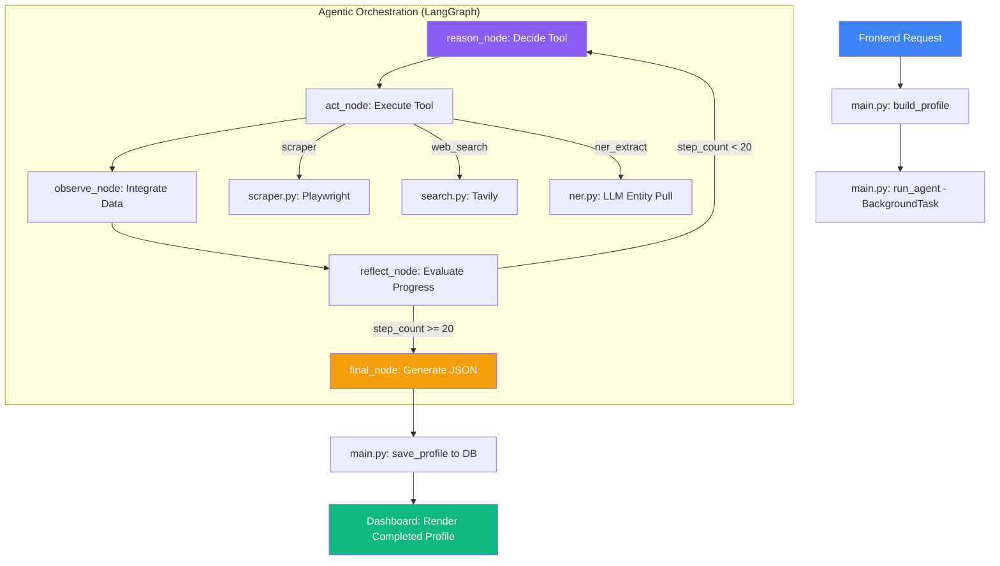

# PERSONA.IQ Project Workflow

This document outlines the complete backend data flow and agentic orchestration of the PERSONA.IQ platform.

## 🏗️ Backend Execution Flow

### 1. API Entry Point
- **File**: `backend/app/main.py`
- **Function**: `build_profile(request: ProfileRequest, background_tasks: BackgroundTasks)`
- **Process**: 
    - Receives target name and URLs from the frontend.
    - Initializes a unique `job_id`.
    - Spawns a `BackgroundTasks` to run the agent without blocking the API response.

### 2. Orchestration Initialization
- **File**: `backend/app/main.py`
- **Function**: `run_agent(job_id, name, urls)`
- **Process**:
    - Sets up the `initial_state` (target name, URLs, empty data).
    - Starts the **LangGraph** execution loop using `orchestrator.app.astream`.

### 3. The ReAct Loop (LangGraph)
The agent operates in a state machine defined in `backend/app/agents/orchestrator.py`.

#### A. Reasoning Node
- **Function**: `reason_node(state)`
- **Logic**: Analyzes what information is missing (Bio, Experience, etc.) and chooses a tool: `scraper`, `web_search`, or `ner_extract`.
- **Constraint**: Enforces "Source-First" logic (Seed URLs are scraped before searching).

#### B. Action Node
- **Function**: `act_node(state)`
- **Logic**: Executes the chosen tool:
    - **Scraper**: `services/scraper.py` -> `scrape(url)` (Playwright).
    - **Search**: `services/search.py` -> `search(query)` (Tavily).
    - **NER**: `services/ner.py` -> `extract_entities(text)` (LLM).

#### C. Observation Node
- **Function**: `observe_node(state)`
- **Logic**: Takes the raw output from the tool and uses the LLM to integrate it into the structured knowledge base (`state["data"]`).

#### D. Reflection Node
- **Function**: `reflect_node(state)`
- **Logic**: Evaluates progress.
- **Safety**: Checks if `step_count >= 20` or if `search_count >= 5`. If so, it sets `complete = True` to break the loop.

### 4. Final Synthesis & Storage
- **File**: `backend/app/agents/orchestrator.py` -> `final_node(state)`
- **Process**: Consolidates all gathered information into the final JSON schema (including AI-analyzed recent posts).
- **File**: `backend/app/main.py` -> `run_agent` (final lines)
- **Process**: Saves the finished profile to the PostgreSQL database via `db.save_profile`.

---

## 📊 Flow Diagram

---

## 🔐 Safety Measures
- **Uvicorn Watcher**: Configured to ignore the `storage/` directory to prevent server restarts during data writes.
- **Playwright Cleanup**: Uses `try...finally` to ensure no zombie chrome processes remain.
- **Circuit Breaker**: Hard stops at 20 total internal steps to prevent infinite loops.
- **Adaptive UI**: Frontend hides empty columns automatically to maintain a premium look even with partial data.
