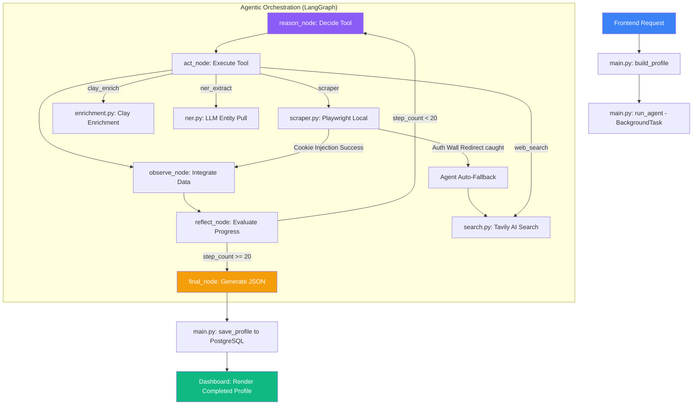

# PERSONA.IQ Project Workflow

This document outlines the complete, current backend data flow, agentic orchestration, and scraping resilience strategies of the PERSONA.IQ platform.

---

## 🏗️ Backend Execution Flow

### 1. API Entry Point
- **File**: [`backend/app/main.py`](file:///d:/Agentic-AI/backend/app/main.py)
- **Function**: `build_profile(request: ProfileRequest, background_tasks: BackgroundTasks)`
- **Process**: 
  - Receives target name and URLs from the frontend dashboard.
  - Spawns a unique `job_id` and records it inside the synchronized in-memory `jobs` store.
  - Returns a `202 Accepted` status along with the `job_id` immediately to the frontend so the UI stays responsive and switches to a real-time polling state.
  - Launches `run_agent` asynchronously using `BackgroundTasks` to execute the agentic loop without blocking the main event loop.

### 2. Orchestration Initialization
- **File**: [`backend/app/main.py`](file:///d:/Agentic-AI/backend/app/main.py)
- **Function**: `run_agent(job_id, name, urls)`
- **Process**:
  - Sets up the starting state structure (`AgentState`) containing target name, seed URLs, empty data dictionaries, step count, and historical logs.
  - Runs the **LangGraph** execution loop asynchronously, streaming state transitions back to the frontend.

---

## 3. The ReAct Loop (LangGraph Agentic Flow)

The agent operates as a state machine defined in [`backend/app/agents/orchestrator.py`](file:///d:/Agentic-AI/backend/app/agents/orchestrator.py). It continuously reasons, acts, observes, and reflects.



### A. Reasoning Node (`reason_node`)
- **Logic**: Analyzes currently extracted information (Bio, Work Experience, Education, Skills, and Recent Posts) against what is missing.
- **Rules**:
  1. **Source-First**: Must scrape all seed URLs provided by the user before executing general web searches.
  2. **Tool Selection**: Dynamically issues a JSON action payload containing the selected tool (`scraper`, `web_search`, `clay_enrich`, or `ner_extract`) and its parameters.
  3. **Apify Removal**: Apify and all paid third-party platforms have been completely removed from the orchestrator prompt and active loops. The agentic flow relies purely on free, highly optimized local browser scraping and resilient AI web search fallbacks.

### B. Action Node (`act_node`)
- **Logic**: Executes the selected tool asynchronously and records the outcome as an `observation`:
  - **`scraper`**: Local browser automation layer.
  - **`web_search`**: Tavily AI Search engine fallback.
  - **`clay_enrich`**: Clay REST API enrichment endpoint (if keys configured).
  - **`ner_extract`**: LLM-driven Entity extraction.

### C. Observation Node (`observe_node`)
- **Logic**: Receives the raw tool output. Feeds it through a summarization/NER layer to cleanly merge it into the structured profile schema (`state["data"]`) without context pollution.

### D. Reflection Node (`reflect_node`)
- **Logic**: Evaluates profile completion. Ensures the agent breaks the loop if it gets stuck, hard-stopping at a maximum of `20` total steps.

---

## 🛡️ Premium Local Scraping & Resilience (Free Layer)

To bypass LinkedIn's aggressive auth walls without incurring third-party proxy costs, [`backend/app/services/scraper.py`](file:///d:/Agentic-AI/backend/app/services/scraper.py) implements the following premium, free-to-use strategies:

### 1. Authenticated Session Cookie Injection
- **Environment Key**: `LINKEDIN_LI_AT` inside `.env`.
- **Logic**: If a `LINKEDIN_LI_AT` value is detected, Playwright launches a local headless Chromium instance and injects the session cookie:
  ```python
  context.add_cookies([{
      "name": "li_at",
      "value": li_at_cookie,
      "domain": ".www.linkedin.com",
      "path": "/"
  }])
  ```
- **Benefit**: Playwright acts as a logged-in user natively on your own machine. This completely avoids login walls and successfully fetches high-fidelity pages for free.

### 2. Dual-Bypass Spoofing (Fallback)
If no cookie is configured, the local scraper dynamically rotates headers:
- **SEO Googlebot Spoofing**: Uses search crawler user-agents (`Mozilla/5.0 (compatible; Googlebot/2.1; ...)`) to view public search-indexed profiles.
- **Mobile Emulation**: Spoofs a mobile viewport and user-agent string (`is_mobile=True`, `375x812`), which triggers lightweight mobile templates that often bypass desktop authentication blocks.

### 3. Defensive Context-Protection
To prevent page evaluate crashes (`Execution context was destroyed`) when LinkedIn performs immediate server-side redirects, the scraper enforces:
- **Navigation Lock**: Waits for full page load completion (`wait_until="load"`) and adds a `2-second` JavaScript stability timeout.
- **Try-Except Evaluates**: Wraps all mouse-movements, human-like scroll scripts (`scrollBy`), and document text extractions inside defensive python `try...except` blocks.
- **Clean Exceptions**: Returns structured error strings instead of crashing, allowing the agent to handle the blocker gracefully.

### 4. Smart Agent Fallback
If the local scraper gets blocked or experiences redirects, it returns a readable block description. The Orchestrator automatically intercepts this error and triggers **Tavily AI Web Search** (`web_search`), bypassing the block for free using Tavily's robust cloud routing network!

---

## 🗄️ Storage & Database Integration
- **PostgreSQL Migration**: The backend has migrated from local SQLite file databases to a centralized, production-ready **PostgreSQL** database instance.
- **File**: [`backend/app/services/storage.py`](file:///d:/Agentic-AI/backend/app/services/storage.py) -> `save_profile(job_id, data)`
- **Behavior**: Stores structured profiles in PostgreSQL upon agent completion, making details instantly available to the glassmorphic frontend dashboard.
