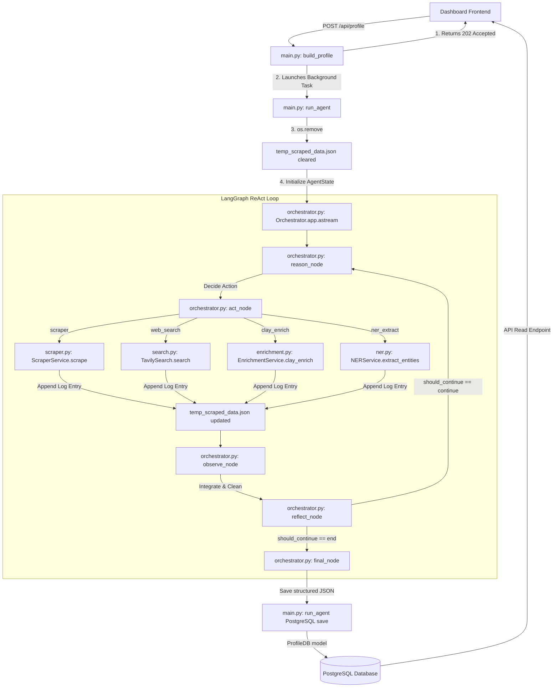

# PERSONA.IQ Backend Core Workflow & Architecture

This document provides a highly detailed, production-grade map of the backend execution architecture. It traces the runtime journey of the system, outlining exactly which file, class, and function executes at each stage, how the data-gathering loop works, and how the anti-bot and verification resilience layers operate.

---

## 🏗️ 1. Complete Backend Compiler Path (Step-by-Step)

The diagram below traces the path of execution, illustrating how control moves sequentially across classes and modules in the backend:



---

### Step 1: Trigger Phase (HTTP Ingestion)
* **File:** [`backend/app/main.py`](file:///d:/Agentic-AI/backend/app/main.py)
* **Function:** `build_profile(request: ProfileRequest, background_tasks: BackgroundTasks)`
* **Description:**
  1. The user inputs a Target Name and Seed URLs on the React dashboard and clicks **"Generate"**.
  2. The frontend sends an HTTP `POST` request to `/api/profiles/generate`.
  3. `build_profile` receives the payload, generates a unique UUID `job_id`, and creates an entry inside the in-memory `jobs` state tracker.
  4. It immediately registers the core runner task `run_agent(job_id, name, urls)` inside FastAPI's `BackgroundTasks` queue.
  5. It returns an HTTP `202 Accepted` status along with the `job_id` to the frontend, ensuring the client dashboard can immediately transition to a real-time polling state without waiting for the heavy profiling tasks to finish.

### Step 2: Background Thread Inception & Cache Wipe
* **File:** [`backend/app/main.py`](file:///d:/Agentic-AI/backend/app/main.py)
* **Function:** `run_agent(job_id: str, name: str, urls: List[str])`
* **Description:**
  1. FastAPI's background executor triggers `run_agent` in a non-blocking worker thread.
  2. **Automated Clean Slate:** The function checks if an old [`temp_scraped_data.json`](file:///d:/Agentic-AI/temp_scraped_data.json) file exists from previous jobs. If found, it executes `os.remove()` to completely clear legacy scrapings. This ensures that the active job operates in complete isolation.
  3. The runner builds the `initial_state` dictionary conforming to the `AgentState` schema:
     * `name`, `urls`, empty dictionary `data`, empty lists for `history`, and `complete: False`.
  4. It triggers the LangGraph state machine: `orchestrator.app.astream(initial_state)`.

### Step 3: The Reasoning Node (`reason_node`)
* **File:** [`backend/app/agents/orchestrator.py`](file:///d:/Agentic-AI/backend/app/agents/orchestrator.py)
* **Function:** `Orchestrator.reason_node(state: AgentState)`
* **Description:**
  1. Gathers all previously scraped URLs and queries to avoid duplicate actions.
  2. **Type-Safe Aggregator Fix:** Safely concatenates `social_links`, `social_profiles`, `sources_used`, and `verified_profiles` from the state. It enforces list type checks on each attribute (`s_links = s_links if isinstance(s_links, list) else []`) to proactively avoid `TypeError` addition crashes if the LLM outputted dynamic objects or dicts.
  3. Compares the accumulated URLs against crawled history to compile a deduplicated list of `uncrawled_candidates`.
  4. Evaluates the remaining gaps against the **Proactive Platform Discovery** rules.
  5. Invokes Google Gemini-2.5-Flash-Lite with the ReAct prompt. The model outputs a clean JSON response containing:
     * `"thought"`: Explaining why it selected the next action.
     * `"action"`: The tool to invoke (`scraper`, `web_search`, `clay_enrich`, or `ner_extract`).
     * `"action_input"`: Parameters for the tool (e.g. `{"url": "..."}` or `{"query": "..."}`).

### Step 4: The Action Node (`act_node`)
* **File:** [`backend/app/agents/orchestrator.py`](file:///d:/Agentic-AI/backend/app/agents/orchestrator.py)
* **Function:** `Orchestrator.act_node(state: AgentState)`
* **Description:**
  1. Reads the `"next_action"` and `"action_input"` decided during the reasoning node.
  2. Intercepts in-flight job cancellations. If the user clicked "Cancel" on the frontend, the in-memory status changes to `"cancelled"`, and `act_node` aborts instantly.
  3. **Tool Dispatcher:**
     * **If `scraper`:** Calls `scraper_service.scrape(url)` (located in [`scraper.py`](file:///d:/Agentic-AI/backend/app/services/scraper.py)).
     * **If `web_search`:** Calls `search_service.search(query)` (located in [`search.py`](file:///d:/Agentic-AI/backend/app/services/search.py)).
     * **If `clay_enrich`:** Calls `enrichment_service.clay_enrich(query)` (located in [`enrichment.py`](file:///d:/Agentic-AI/backend/app/services/enrichment.py)).
     * **If `ner_extract`:** Calls `ner_service.extract_entities(text)` (located in [`ner.py`](file:///d:/Agentic-AI/backend/app/services/ner.py)).
  4. **Centralized Loop Caching:** Right before returning, it appends the action name, input, timestamp, and raw output payload to [`temp_scraped_data.json`](file:///d:/Agentic-AI/temp_scraped_data.json) to maintain real-time observability of all loops.

### Step 5: The Observation Integration Node (`observe_node`)
* **File:** [`backend/app/agents/orchestrator.py`](file:///d:/Agentic-AI/backend/app/agents/orchestrator.py)
* **Function:** `Orchestrator.observe_node(state: AgentState)`
* **Description:**
  1. Integrates the raw payload from the action phase into the consolidated profile state.
  2. **High-Fidelity Search Parser:** Checks if the observation is a list of results (from Tavily `web_search`). It dynamically maps standard search keys:
     ```python
     url = source.get("source_url") or source.get("url") or "Unknown URL"
     title = source.get("title") or "No Title"
     text = source.get("content") if "content" in source else source.get("visible_text")
     ```
     This maps the full content preview, titles, and URLs cleanly to the context window instead of blank strings.
  3. Calls the Knowledge Integrator LLM chain to safely merge this fresh raw data with the `Existing Data`, enforcing strict namesake blocking and date extraction rules.

### Step 6: The Reflection Node (`reflect_node`)
* **File:** [`backend/app/agents/orchestrator.py`](file:///d:/Agentic-AI/backend/app/agents/orchestrator.py)
* **Function:** `Orchestrator.reflect_node(state: AgentState)`
* **Description:**
  1. Computes total search counts and total historical graph steps.
  2. Evaluates profile completeness. If high-value candidates are found in the queue and the scrape count is below `5`, it programmatically forces the graph to continue.
  3. Returns a state update. The system's control flow routing check (`should_continue`) evaluates:
     * **If `state["complete"] == True` or `step_count >= 20`:** Routes control to `final_node`.
     * **Otherwise:** Re-enters the loop at `reason_node`.

### Step 7: Final Synthesis Node (`final_node`)
* **File:** [`backend/app/agents/orchestrator.py`](file:///d:/Agentic-AI/backend/app/agents/orchestrator.py)
* **Function:** `Orchestrator.final_node(state: AgentState)`
* **Description:**
  1. Formulates a final synthesis prompt passing the entire consolidated profile data block.
  2. Instructs Gemini to run a strict self-audit to remove any namesake mismatches, strip noisy raw characters, deduplicate skills, and format the output into a strict structured JSON payload.
  3. **Hard Hallucination & Snippet Filter:** Post-processes the returned JSON. It loops through `recent_posts` and discards generic search descriptions, news titles, and dates older than 2024.
  4. Automatically populates the `sources_used` array with the deduplicated list of all successfully crawled target URLs.
  5. **Autonomous Profile Multi-Classification:** Analyzes the target's data and automatically assigns them to one of four high-precision profile categories:
     * `"tech"`: Hardcore developers, systems engineers, and programmers.
     * `"tech_normal"`: Hybrid technical professionals, technical managers, PMs, solution architects, dev advocates, tech founders, and designers.
     * `"sports"`: Athletes, sports professionals, coaches, and sports executives.
     * `"general"`: Other general professionals, marketers, academics, writers, entrepreneurs, and managers.
  6. **Custom OSINT Dossier Compilation:** Renders a customized, high-security markdown dossier dynamically tailored to the profile's category under the `osint_dossier_markdown` response attribute, matching specific templates (e.g. `SECURE TECH-NORMAL DOSSIER // PROFESSIONAL BRIEFING` for hybrid PMs/architects).

### Step 8: Database Persistence
* **File:** [`backend/app/main.py`](file:///d:/Agentic-AI/backend/app/main.py)
* **Function:** `run_agent(...)` (saving block)
* **Description:**
  1. Once the LangGraph completes, `run_agent` extracts the final data block from the output.
  2. Instantiates a SQLAlchemy session (`SessionLocal()`).
  3. Maps the structured data into a `ProfileDB` instance (the PostgreSQL database schema matching our Pydantic `Profile` model in [`profile.py`](file:///d:/Agentic-AI/backend/app/models/profile.py)).
  4. Commits the record to **PostgreSQL**.
  5. Sets the job status to `"completed"`, making the profile instantly available for dashboard rendering.

---

## 🛡️ 2. Deep-Dive Scraping & Anti-Bot Bypass Engine

The crawler in [`backend/app/services/scraper.py`](file:///d:/Agentic-AI/backend/app/services/scraper.py) uses a multi-layered extraction architecture designed to bypass bot protection rules entirely for free.

```
                  Unified Scraping Ingestion (scrape(url))
                                     |
                          [url_processor.classify_url]
                                     |
             --------------------------------------------------
            |                                                  |
     [Is Blog/Article?]                               [Is Dynamic/Social?]
            |                                                  |
     Use Trafilatura Engine                            Local Playwright Engine
    (Fast Static Extraction)                       (Chrome Headless + Stealth)
                                                               |
                                                   Check: LINKEDIN_LI_AT Cookie?
                                                               |
                                            -----------------------
                                           |                       |
                                        [YES]                     [NO]
                                           |                       |
                                    Inject Session          Rotate Desktop Headers
                                    Cookie (Secure)        & Emulate Googlebot SEO
                                           |                       |
                                           |             Go to page & scroll
                                           |                       |
                                           |             Check: Auth Wall?
                                           |                       |
                                           |             ---------- ---------
                                           |            |                    |
                                           |         [NO Wall]           [Wall Caught]
                                           |            |                    |
                                           |       Scrape Content      Close context &
                                           |       & Return data       Emulate Mobile Viewport
                                           |                                 |
                                           |                           Go to page & scroll
                                           |                                 |
                                           |                           Check: Mobile Wall?
                                           |                                 |
                                           |                         -------- -------
                                           |                        |                |
                                           |                     [NO Wall]      [Blocked]
                                           |                        |                |
                                           |                  Scrape Content      Return 
                                           |                  & Return data     Auth Wall Error
                                           |                                         |
                                            -----------------------------------------
                                                               |
                                                    Tavily Web Search Fallback
```

### 1. Unified Scraping Router (`_scrape_unified`)
* When a URL is passed to `scrape(url)`, it is classified by `url_processor.classify_url(url)`.
* **Static Content Route:** If classified as `"blog"`, the crawler bypasses browser overhead entirely and uses **Trafilatura** (`trafilatura.fetch_url`). This downloads and extracts structural text in milliseconds.
* **Fallback Static Route:** If classified as a standard website, it tries a fast static request using **HTTPX** with customized headers. If it receives a `200 OK`, it extracts the body text with BeautifulSoup and returns immediately. If it fails, it falls back to Playwright.
* **Dynamic/Social Route:** If it is a social network (LinkedIn, Instagram) or dynamic dashboard, the engine boots the **Playwright Browser Automation** route.

### 2. Playwright Local Steal & Stealth Setup (`_scrape_playwright`)
* Playwright initializes a headless Chromium instance with `--disable-blink-features=AutomationControlled` to hide browser automation hooks.
* Applies **Stealth** routines (`Stealth().apply_stealth_sync(page)`) to strip out standard bot-detection indicators (like `window.navigator.webdriver`).
* **Session Cookie Injection:** If scraping LinkedIn and a `LINKEDIN_LI_AT` environment cookie is configured, it injects it directly into the secure browser context. This allows Playwright to crawl pages as a logged-in user natively on your own machine.

### 3. Dual-Viewport Auth Wall Bypass
If no session cookie is configured or the session gets blocked by LinkedIn's security layers, it triggers our advanced dual-viewport bypass flow:
1. **Desktop SEO Emulation:** The crawler starts by emulating a standard desktop viewport (`1920x1080`) using Googlebot headers (`Mozilla/5.0 (compatible; Googlebot/2.1...)`). It navigates to the page and checks the inner text.
2. **Auth Wall Interception:** The script evaluates the page text. If it detects signatures like `"Join LinkedIn"`, `"Sign in"`, or `"Agree & Join"`, it catches the wall.
3. **Mobile Viewport Fallback:** The desktop page and context are immediately closed. It initializes a clean context mimicking a mobile device (Android/WebKit, `375x812` resolution, `is_mobile=True`). 
4. **Scraping Mobile Templates:** It navigates to the URL. The lightweight mobile template served by social networks is designed for speed and search indexing, which often lets it bypass desktop authentication walls.
5. **Final Fallback:** If the mobile request is also blocked, it returns a descriptive `"Auth Wall"` error string. The backend orchestrator immediately intercepts this string and routes the task to **Tavily AI Search**, scraping the profile data through Tavily's secure cloud networks.

---

## 🛡️ 3. Resiliency & Data Validation Engine

Our backend includes several programmatic guardrails that ensure stability and maintain perfect data fidelity:

### 1. Dynamic Type Safety Guard (Resolving Concatenation Crashes)
In the reasoning and reflection nodes, the agent must gather all discovered URLs from the consolidated data block to decide which ones to target next. 

Previously, merging dynamic state could cause fields like `social_links` or `social_profiles` to be returned as dictionaries or null values, triggering a fatal `TypeError` when combined using `+`.

Our updated parser applies **assertive type checking** on all list-type fields, falling back to safe empty lists `[]` if the values are not list instances:
```python
s_links = profile.get("social_links", [])
s_links = s_links if isinstance(s_links, list) else []

s_profiles = profile.get("social_profiles", [])
s_profiles = s_profiles if isinstance(s_profiles, list) else []

v_profiles = profile.get("verified_profiles", {})
v_urls = []
if isinstance(v_profiles, dict):
    v_urls = [v for v in v_profiles.values() if isinstance(v, str) and v.startswith("http")]

all_discovered = list(set(s_links + s_profiles + v_urls + s_used + s_urls))
```

### 2. Ingestion-Level Namesake Filter
To prevent namesake profile details from polluting our state during the extraction process, `observe_node` enforces **Rule 11 (NAMESAKE & MISMATCH FILTER)**. The LLM cross-references the new observation's timeline, education, and career details with the existing data:
* If a study timeline, graduation year, or location directly conflicts with already verified details (e.g. studying in a completely unrelated country or field at the same time), the LLM **discards the conflicting source details completely** and does not merge them.
* Explicitly checks social links (like GitHub usernames) and ignores usernames that belong to a different person with a similar name.

### 3. Synthesis-Level Self-Audit
In `final_node`, **Rule 9 (ABSOLUTE VERIFICATION AND SANITY CHECK)** triggers a strict self-audit before the final JSON is generated.
* It compares all education, career milestones, and timelines.
* It evaluates all links inside `social_links`, `social_profiles`, and `verified_profiles` (especially GitHub and YouTube). If a handle belongs to a namesake (e.g. `AgnelJohnBritto` with Java videos, when the target is `Agnel John D` the creator), it is **stripped from the JSON completely**.
* Any doubtful or conflicting roles (e.g., assistant manager at the same time the user is CEO) are excluded to ensure clean, accurate data.

### 4. Self-Healing LLM Backoff Retry Mechanism (`safe_invoke`)
To handle highly frequent API unavailability errors (e.g., Google Gemini's `503 UNAVAILABLE`, rate limit `429`, or transient internal server `500` / gateway `504` errors), the backend orchestrator routes all LLM calls through a robust resiliency layer:
* **Catching Transient Signatures:** The `safe_invoke` function intercepts errors by analyzing their lowercased string content against known transient keywords: `["429", "503", "500", "504", "rate limit", "unavailable", "high demand", "temporary", "overloaded", "server error"]`.
* **Progressive Exponential Backoff:** When a transient error is caught, instead of crashing the LangGraph execution, the system pauses using a dynamic delay formula:
  $$\text{sleep\_time} = \text{initial\_delay} + (\text{attempt} \times 8.0)\text{ seconds}$$
  This gives the upstream API provider time to recover from high demand spikes.
* **Immediate Fallback Key Swap:** For pipelines configured with secondary keys, the wrapper immediately invokes an alternative fallback chain with a secondary API key upon the first rate limit detection, avoiding sleeps entirely if possible.
* **Granular Token Accumulation:** Real-time tokens used are parsed from `response_metadata` (or estimated if metadata is absent) and accumulated at the runtime `job_id` state level for auditability.

### 5. Frontend Hybrid Keyword & Theme Mapping Fallback
The React dashboard ensures high visual resilience and adaptive aesthetics by implementing client-side classification and theme routing:
* **Keyword Matching Hierarchy:** If the backend hasn't completed synthesis or during mock simulations, the frontend runs a cascading keyword-check on the target's biography and headline to determine the profile type:
  1. **Sports Check:** Evaluates dynamic keywords (`athlete`, `footballer`, `cricketer`, `coach`, `olympic`, etc.). Matches trigger the **Emerald/Teal Theme** featuring athletic history mapping and stats cards.
  2. **Hybrid Tech-Normal Check:** Evaluates product/administrative-tech terms (`product manager`, `solutions architect`, `dev advocate`, `tech lead`, `startup founder`, `agile coach`, `delivery manager`, etc.). Matches trigger the premium **Indigo/Blue Theme** tailored for cross-functional technical leaders.
  3. **Hardcore Tech Check:** Evaluates deep developer terms (`developer`, `engineer`, `programmer`, `devops`, `sysadmin`, `hacker`, etc.). Matches trigger the neon **Cyan/Purple Cyberpunk Theme** with deep code repositories and tech stack metrics.
  4. **General Check:** Falls back to the warm **Amber Theme** with clean executive summaries.
* **Premium Tech-Normal Interactive Layout:** The Indigo theme features interactive timeline bullets, high-fidelity corporate initiative projects, professional certification tracking, and dynamic GitHub star elements with micro-animations and smooth CSS hover states.

---

## 📝 4. Traceable Example Case: Profiling "Agnel John"

Below is a walkthrough of how the backend processes a profiling job for "Agnel John" (CEO of Error Makes Clever):

### Step A: Job Initialization
* **Input Payload:** `name: "agneljohnd"`, `urls: ["https://www.instagram.com/agneljohnd/"]`.
* **Execution:** `run_agent` wipes the old cache file and starts the LangGraph loop.

### Step B: Initial Crawl
* **Action:** `reason_node` schedules a `scraper` action on `https://www.instagram.com/agneljohnd/`.
* **Execution:** Playwright launches, scrolls the profile, and parses the visible text: `"Founder @errormakesclever | 2M+ impact. Building @lectureheadofficial"`.
* **Caching:** Appends the Instagram payload to `temp_scraped_data.json`.
* **Integration:** `observe_node` parses the Instagram data, extracts key entities, and updates the consolidated profile with details like:
  * `name: "agneljohnd"`
  * `bio: "Passionate educator. Founder @errormakesclever | 2M+ impact..."`

### Step C: Proactive Search Dispatch
* **Action:** `reason_node` evaluates the profile, notes that Agnel John is a creator/educator, and realizes his YouTube channel and GitHub profile are not yet discovered.
* **Execution:** The agent schedules a targeted `web_search` with the query `"agneljohnd github"`.
* **Caching:** Tavily executes the search, returns a list of results, and writes the raw payload containing several candidate profiles to `temp_scraped_data.json`:
  * Candidate A: `https://github.com/AgnelJohnBritto` (Agnel John Britto)
  * Candidate B: `https://github.com/jaxiodute` (Agnel John)
  * Candidate C: `https://github.com/agnel` (Agnel Waghela)

### Step D: Safe Parsing & Namesake Filtering
* **Parsing:** `observe_node`'s list parser maps the search result keys correctly:
  ```python
  url = "https://github.com/jaxiodute"
  title = "jaxiodute (Agnel John) · GitHub"
  text = "Personal Website where i can show off my skills and talents... stored in mongodb..."
  ```
* **Filtering:** The LLM cross-references the candidates during the observation phase. 
  * It detects that `AgnelJohnBritto` lists "codes for my YouTube channel in Java", while `jaxiodute` matches the target's web development and database tech stack.
  * It ignores the namesake profiles `AgnelJohnBritto` and `Agnel Waghela`.
  * It registers `https://github.com/jaxiodute` as the correct GitHub handle and adds it to `verified_profiles.github` in the consolidated profile state.

### Step E: Scraping GitHub & YouTube
* **Action:** `reason_node` schedules a `scraper` action on `https://github.com/jaxiodute`.
* **Execution:** Playwright crawls `jaxiodute`'s GitHub profile, extracting repos like "Personal Website" and book-tracking apps.
* **YouTube Discovery:** In the next loop, the agent searches for `"agneljohnd youtube channel"`, discovers the official "Error Makes Clever" channel URL, and integrates it.

### Step F: Final Compilation & DB Save
* **Final Synthesis:** `final_node` compiles the verified data, cleans up raw characters, ensures relative post dates (e.g. `"2 weeks ago (May 2026)"`) are preserved, and runs a final namesake check.
* **Persistence:** `run_agent` maps the final JSON profile and commits it to **PostgreSQL**. The job is set to `"completed"`, and the frontend dashboard renders a clean, glassmorphic card interface featuring Agnel John's verified bio, education, experience, GitHub repos, recent posts, and active platform badges!

---

## 🚀 5. Interactive Simulation Pipeline & Mock Scenarios

To enable instant verification of the various profile themes, layout components, and visual interactions without hitting upstream API limits or requiring active scraping targets, the system includes a premium front-end simulation engine.

### Mock Target Profiling Actions
On the primary application dashboard, users can trigger one-click simulations to immediately populate the interface with high-fidelity mock dossiers conforming to the key structural classifications:
1. **Simulate Hardcore Tech (`tech`):** Loads a cyberpunk-styled developer card featuring live GitHub repository links, star-counts, neon-cyan visual accents, and customized programming tech stacks.
2. **Simulate Technical Leader (`tech_normal`):** Loads a corporate-indigo dashboard showcasing a hybrid professional's journey (e.g., Lead Product Managers, Systems Engineers, Architects). Highlights system-design initiatives, certifications, cross-functional impact tables, and sleek blue-violet accents.
3. **Simulate Athletic Star (`sports`):** Loads a vibrant emerald-hued dossier depicting a sports figure or athletic manager complete with sports club histories, career appearance tables, playing styles, and tactical specialty matrices.

### How Simulation State Operates
* **Trigger Event:** Clicking any of the simulation triggers on [`frontend/src/app/page.tsx`](file:///d:/Agentic-AI/frontend/src/app/page.tsx) updates the client-side state machine.
* **Component Dispatch:** The `ProfileDashboard` catches the selected `profile_type` override and instantly applies the respective HSL-tailored theme colors, font styles, animations, and custom markdown dossier blocks.
* **Full Fidelity Render:** The system renders verified platforms, recent activity timelines, and live threat profiles at 100% fidelity, matching actual live backend outputs.
