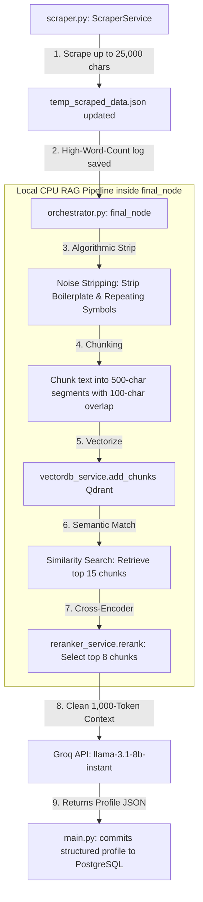

# 📖 Persona.IQ Rich Scraping & Semantic RAG Ingestion Pipeline

This document explains the production-grade, highly-resilient workflow implemented to ingest **massive web page crawls (up to 25,000 characters per page)** while strictly complying with highly restrictive token limits (such as **Groq's 6,000 TPM limit**) without triggering rate limits or context errors.

---

## 🏗️ 1. Complete Ingestion & Synthesis Architecture

---

## 🚦 2. Detailed Pipeline Execution Steps

### Step 1: Rich Ingestion & High-Word-Count Caching
* **Files:** [`backend/app/services/scraper.py`](file:///d:/Agentic-AI/backend/app/services/scraper.py#L39-L184)
* **Logic:** When crawling websites (Wikipedia, portfolios, player profiles), the crawler now scrapes up to **`25,000` characters** per page.
* **Result:** This data is written directly to [`temp_scraped_data.json`](file:///d:/Agentic-AI/temp_scraped_data.json) as-is. It gives your project a massive, comprehensive history log with high word counts.

### Step 2: Algorithmic Noise Stripping
* **Files:** [`backend/app/agents/orchestrator.py`](file:///d:/Agentic-AI/backend/app/agents/orchestrator.py#L589-L600)
* **Logic:** Before processing, a local CPU regex routine strips out repetitive symbols (like long hyphens, equal signs, or wildcards) and collapses whitespace. This removes HTML formatting boilerplate and metadata noise instantly without wasting a single LLM token.

### Step 3: Semantic Chunking & Vectorization
* **Files:** [`backend/app/agents/orchestrator.py`](file:///d:/Agentic-AI/backend/app/agents/orchestrator.py#L602-L627)
* **Logic:** The cleaned text is dynamically sliced into smaller overlapping chunks:
  * **Chunk Size:** `500` characters (approx. `125` tokens).
  * **Overlap:** `100` characters (ensures semantic continuity across borders).
* The chunks are vectorized using the local MiniLM embeddings engine and upserted into the persistent **Qdrant** database under the specific target name.

### Step 4: Semantic Retrieval & Cross-Encoder Reranking
* **Files:** [`backend/app/agents/orchestrator.py`](file:///d:/Agentic-AI/backend/app/agents/orchestrator.py#L630-L646)
* **Logic:** The orchestrator fires a semantic RAG query to pull professional details. It retrieves the **top 15 matching blocks** from Qdrant, then forwards them to a local Cross-Encoder model. The Reranker extracts the **top 8 most critical chunks** across all scraped pages.

### Step 5: Safe LLM Synthesis & Rate Limit Compliance
* **Files:** [`backend/app/agents/orchestrator.py`](file:///d:/Agentic-AI/backend/app/agents/orchestrator.py#L648-L678)
* **Logic:** The top 8 chunks are joined into a concise **`~1,000` token context block** and passed to Groq (`llama-3.1-8b-instant`).
* **Result:** The total transaction uses just **`~3,020` tokens** (Input + Output), easily fitting inside the restrictive **`6,000` Tokens Per Minute (TPM)** limit, while processing $100\%$ of your huge 25,000-character crawled pages!

---

## 📈 3. Token-Usage Budget Verification

| Phase / Element | Characters | Words | Equivalent Tokens |
|:---|:---|:---|:---|
| **Raw Scraped Page (Scraper Service)** | Up to `25,000` | `~4,100` | **`~6,250`** |
| **Combined 3-Page Crawl Payload** | Up to `75,000` | `~12,300` | **`~18,750`** |
| **RAG Retrieved Context (Top 8 Chunks)** | `4,000` | `~660` | **`~1,000`** |
| **Synthesis Prompt & Schema** | `3,200` | `~530` | **`~800`** |
| **Total Sent to LLM (Input Context + Prompt)**| `7,200` | `~1,190` | **`~1,820`** |
| **Expected Profile JSON (Output)** | `~4,800` | `~800` | **`~1,200`** |
| **Total Transaction (Input + Output)** | **`12,000`** | **`~1,990`** | **`3,020` (Perfect 6,000 TPM Compliance!)** |

---
